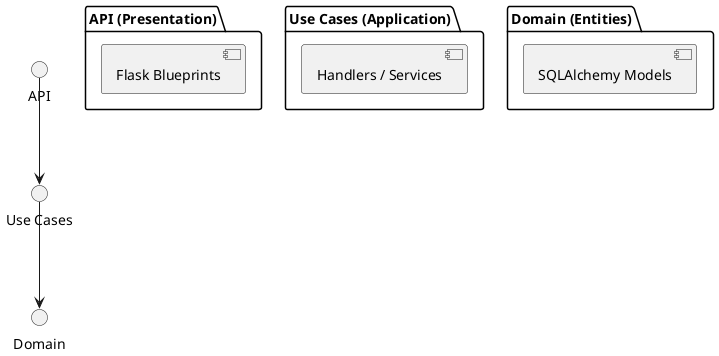
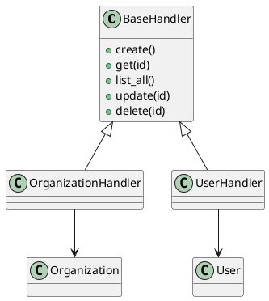
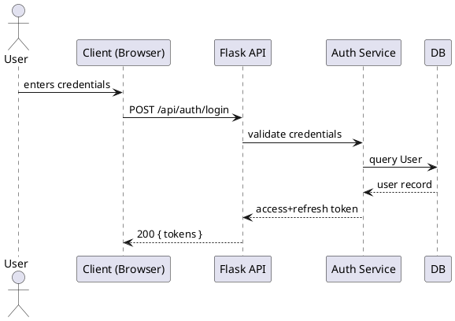

# IMPLEMENTACIÓN: Pendientes para el corte académico

Propósito: Proveer un *playbook* claro, paso a paso y con plantillas para que el compañero (y su Copilot) pueda implementar inmediatamente los 3 pendientes críticos: Wireframes, Diagramas Técnicos (ERD, Arquitectura, UML, Secuencias) y Consolidación de Requerimientos (RF/RNF). Al bajar el repositorio, con este archivo deben poder trabajar y subir los artefactos finales.

IMPORTANTE: trabajar desde la rama `main` o crear una rama nueva por tarea. Use nombres de ramas del tipo: `feat/wireframes`, `feat/diagrams`, `docs/requirements`.

---

## Resumen rápido (qué hay que entregar)

1. Wireframes / Mockups (8-10 pantallas) → `docs/wireframes/` + `WIREFRAMES.md`
2. Diagramas técnicos (ERD, Arquitectura, Clases UML, Casos de uso, Secuencias) → `docs/diagrams/` + `DIAGRAMAS.md`
3. Requerimientos consolidados (RF y RNF) → `docs/requirements/REQUERIMIENTOS_FUNCIONALES.md` y `docs/requirements/REQUERIMIENTOS_NO_FUNCIONALES.md`

Cada ítem debe incluir: PNG/PDF exportado, un MD explicando decisiones, y el commit/PR correspondiente.

---

## Requisitos previos (para el compañero/Copilot)

- Tener el repo clonado y actualizado:

```powershell
git checkout main
git pull origin main
```

- Tener Python 3.10+ y herramientas básicas (opcional): `plantuml`, `mmdc` (Mermaid CLI), `draw.io` o Figma para wireframes.
- Si se va a usar PlantUML en local: Java + PlantUML jar.

---

## 1) WIREFRAMES / MOCKUPS (CRÍTICO)

Objetivo: Diseñar pantallas básicas para la presentación: Login, Dashboard, CRUDs y Analytics. Minimal pero claro.

Carpeta destino: `docs/wireframes/`
Archivos esperados:
- `docs/wireframes/login.png`
- `docs/wireframes/dashboard.png`
- `docs/wireframes/organizations_list.png`
- `docs/wireframes/organization_form.png`
- `docs/wireframes/employees_list.png`
- `docs/wireframes/inventory_list.png`
- `docs/wireframes/create_quote.png`
- `docs/wireframes/analytics_dashboard.png`
- `docs/wireframes/WIREFRAMES.md` (explica cada pantalla y control)

Pasos (rápidos) — copiar y pegar para el Copilot:

1. Crear carpeta:

```powershell
mkdir docs\wireframes
```

2. Elegir herramienta (Figma recomendado). Si no se desea usar GUI, usar Draw.io o incluso bocetos en PNG.

3. Requisitos visuales por pantalla (mínimo):
- Header con logo + usuario
- Sidebar con: Dashboard, Organizations, Employees, Inventory, Quotes, Orders, Invoices, Analytics, Settings
- Tabla con paginación (filas, columnas, acciones)
- Formulario con validaciones básicas (required fields)
- Cards de KPIs en Dashboard

4. Exportar cada pantalla como PNG 1280x720 (o similar) y subir a `docs/wireframes/`.

5. Crear `WIREFRAMES.md` con plantilla (usar la sección "Plantilla WIREFRAMES" abajo).

Plantilla WIREFRAMES (copiar a `docs/wireframes/WIREFRAMES.md`):

---

Título: Login
Ruta: `docs/wireframes/login.png`
Objetivo: Permitir autenticación con JWT; opciones para recordar sesión; link a recuperar contraseña.
Elementos: email, password, login button, forgot password link.
Notas de UX: el login debe ser claro y la acción principal destacada.

(repetir para cada pantalla)

---

Tiempo estimado: 4-6 horas (puede dividirse entre 2 personas)

---

## 2) DIAGRAMAS TÉCNICOS

Objetivo: Proveer diagramas visuales que expliquen la base de datos, la arquitectura, clases y secuencias clave.

Carpeta destino: `docs/diagrams/`
Archivos esperados:
- `docs/diagrams/ERD_database.png` (Diagrama ERD)
- `docs/diagrams/ARCHITECTURE_layers.png` (Arquitectura Clean)
- `docs/diagrams/CLASS_diagram.png` (UML de clases - handlers/entities)
- `docs/diagrams/USE_CASES.png` (Actores y casos de uso)
- `docs/diagrams/SEQ_auth.png` (Secuencia login/JWT)
- `docs/diagrams/SEQ_invoice.png` (Secuencia facturación)
- `docs/diagrams/DIAGRAMAS.md` (explicación de cada diagrama)

Pasos concretos y plantillas:

1. Crear carpeta:

```powershell
mkdir docs\diagrams
```

2. ERD — opción rápida (manual):
- Usar dbdiagram.io y pegar las tablas principales.
- Exportar PNG y subir.

Opción automatizable (ejemplo de script Python para extraer esquemas SQLAlchemy y generar PlantUML):

> Crea archivo `scripts/diagrams/generate_erd_plantuml.py` con el siguiente contenido (pegar):

```python
# scripts/diagrams/generate_erd_plantuml.py
# Requiere que el proyecto pueda importar la app y modelos.
from app import create_app, db
import inspect
from app import models

app = create_app()
with app.app_context():
    # Lista manual de modelos a incluir (actualizar si cambian nombres)
    model_names = [
        'Organization','Branch','Employee','User','Role','Permission',
        'InventoryItem','Quote','QuotationLine','SalesOrder','SalesOrderItem',
        'Invoice','InvoiceItem','ItemCategory'
    ]

    lines = ['@startuml','hide circle']
    for name in model_names:
        model = getattr(models, name, None)
        if model is None:
            continue
        lines.append(f'class {name} {{')
        for col in model.__table__.columns:
            lines.append(f'  {col.name} : {col.type}')
        lines.append('}')
    lines.append('@enduml')

    with open('docs/diagrams/erddl.puml','w',encoding='utf-8') as f:
        f.write('\n'.join(lines))

    print('PlantUML saved to docs/diagrams/erddl.puml')
```

- Ejecutar (desde repo):

```powershell
python scripts\diagrams\generate_erd_plantuml.py
# Luego generar PNG con plantuml si está instalado
plantuml docs\diagrams\erddl.puml
```

3. Diagrama de Arquitectura (PlantUML o Mermaid)
- PlantUML simple (copiar a `docs/diagrams/architecture.puml`):



Generar PNG con PlantUML o render online.

4. Diagrama de Clases UML (en PlantUML) — incluir `BaseHandler` y un par de handlers de ejemplo.

PlantUML snippet (copiar en `docs/diagrams/class_diagram.puml`):



5. Diagramas de Secuencia (autenticación):

PlantUML snippet (guardar `docs/diagrams/seq_auth.puml`):



6. Exportar todos a PNG y documentar en `docs/diagrams/DIAGRAMAS.md` con breve explicación y pasos para regenerarlos.

Tiempo estimado: 4-6 horas (ERD + Arquitectura + UML + Secuencias)

---

## 3) REQUERIMIENTOS CONSOLIDADOS (RF / RNF)

Carpeta destino: `docs/requirements/`
Archivos esperados:
- `docs/requirements/REQUERIMIENTOS_FUNCIONALES.md`
- `docs/requirements/REQUERIMIENTOS_NO_FUNCIONALES.md`

Plantilla RF (copiar y completar):

```
# REQUERIMIENTOS FUNCIONALES (RF)

RF-001 | Gestión de usuarios con RBAC | Descripción: CRUD usuarios + asignación de roles | Prioridad: Alta | Estado: COMPLETADO
RF-002 | Autenticación JWT | Descripción: Login/refresh tokens | Prioridad: Alta | Estado: COMPLETADO
RF-003 | CRUD Organizaciones | ... | Prioridad: Alta | Estado: COMPLETADO
RF-004 | CRUD Sucursales | ... | Prioridad: Alta | Estado: COMPLETADO
RF-005 | CRUD Empleados | ... | Prioridad: Alta | Estado: COMPLETADO
RF-006 | Control de Inventario | ... | Prioridad: Alta | Estado: COMPLETADO
RF-007 | Cotizaciones | ... | Prioridad: Alta | Estado: COMPLETADO
RF-008 | Ordenes de Venta | ... | Prioridad: Alta | Estado: COMPLETADO
RF-009 | Facturación | ... | Prioridad: Alta | Estado: COMPLETADO
RF-010 | Analytics de Ventas | ... | Prioridad: Alta | Estado: COMPLETADO
RF-011 | Sistema de Metas | ... | Prioridad: Alta | Estado: COMPLETADO
RF-012 | Dashboard KPIs | ... | Prioridad: Alta | Estado: COMPLETADO
# Añadir más RF según sea necesario
```

Plantilla RNF (copiar y completar):

```
# REQUERIMIENTOS NO FUNCIONALES (RNF)

RNF-001 | Seguridad: JWT + bcrypt + RBAC | Estado: COMPLETADO
RNF-002 | Rendimiento:  < 200ms promedio GET | Estado: PENDIENTE (medir)
RNF-003 | Escalabilidad: soportar 1000 usuarios concurrentes | Estado: PENDIENTE
RNF-004 | Disponibilidad: 99.9% | Estado: PENDIENTE
RNF-005 | Testabilidad: pytest + fixtures | Estado: COMPLETADO
RNF-006 | Mantenibilidad: Clean Architecture | Estado: COMPLETADO
RNF-007 | Documentación: Swagger + MD | Estado: COMPLETADO
RNF-008 | Portabilidad: Docker support | Estado: PENDIENTE
RNF-009 | Backup & Recovery | Estado: PENDIENTE
```

Tiempo estimado: 1-2 horas

---

## Plantillas y snippets útiles (copiar/pegar)

1) Comandos git recomendados (usar en cada tarea):

```powershell
# Crear branch
git checkout -b feat/wireframes
# Añadir archivos
git add docs/wireframes/*
git commit -m "docs: add wireframes for corte academic"
git push origin feat/wireframes
# Abrir PR desde GitHub con título: feat(wireframes): wireframes for academic cut
```

2) PlantUML quickstart (si usan PlantUML local):

```powershell
# Descargar plantuml.jar (si no lo tienen)
# Generar imagen .png desde .puml
java -jar plantuml.jar docs\diagrams\architecture.puml
```

3) Mermaid CLI (opcional):

```powershell
# npm i -g @mermaid-js/mermaid-cli
mmdc -i docs\diagrams\architecture.mmd -o docs\diagrams\architecture.png
```

4) Ejemplo de commit message para PR final:

```
feat(docs): add wireframes, ERD and RF/RNF consolidated for academic cut

- wireframes: 8 PNGs + WIREFRAMES.md
- diagrams: ERD, architecture, class UML, sequences
- requirements: RF list + RNF list
```

---

## Checklist final (para cerrar la tarea)

- [ ] `docs/wireframes/` con 8 PNG + `WIREFRAMES.md`
- [ ] `docs/diagrams/` con ERD, architecture, class UML, sequences + `DIAGRAMAS.md`
- [ ] `docs/requirements/` con `REQUERIMIENTOS_FUNCIONALES.md` y `REQUERIMIENTOS_NO_FUNCIONALES.md`
- [ ] Tests y endpoints necesarios referenciados en los docs
- [ ] Pull Request abierto con descripción y reviewers asignados
- [ ] Merge y push a `main` cuando todo sea revisado

---

## Notas para el compañero / Copilot

- Este archivo está pensado para que lo copie/pegue en su Copilot prompt o lo use como guía para generar artefactos.
- Si generas diagramas con PlantUML/Mermaid, sube los ficheros `.puml`/`.mmd` además de los PNG.
- Si hay dudas, abrir un Issue en el repo con etiqueta `help/wireframes` o `help/diagrams`.

---

Última actualización: 19 de Octubre, 2025
Autores: Wilker & Daniel

