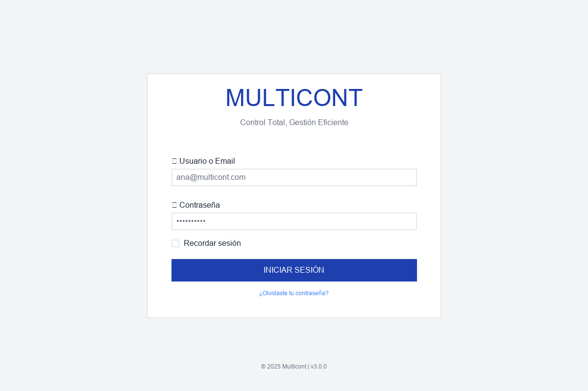
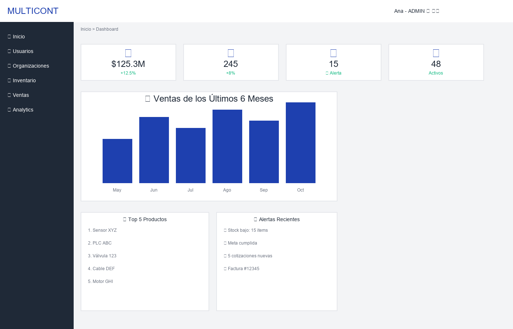
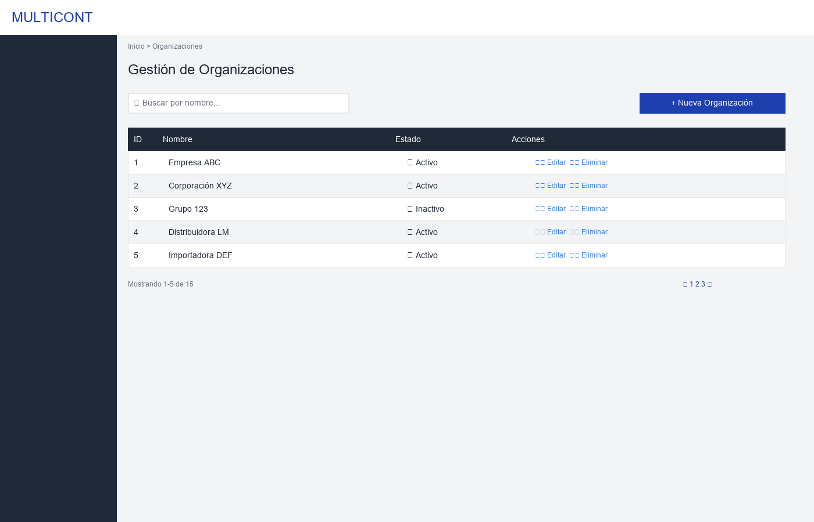
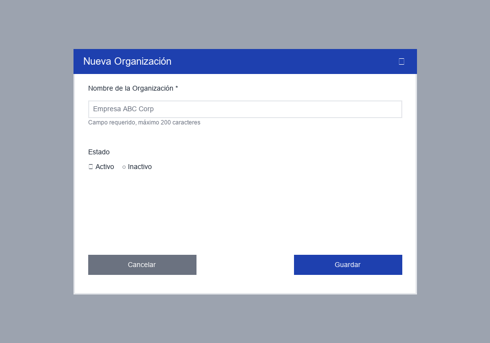
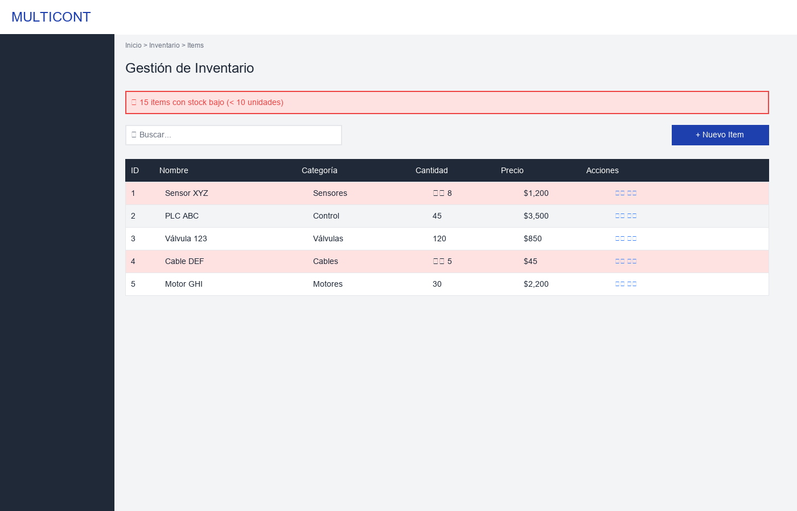
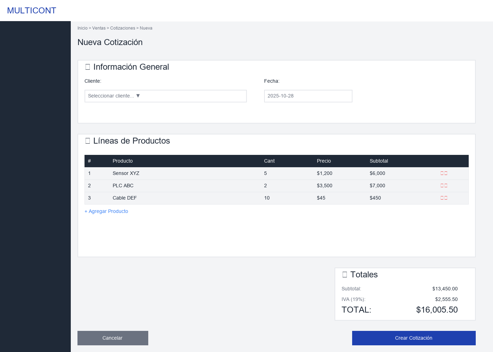
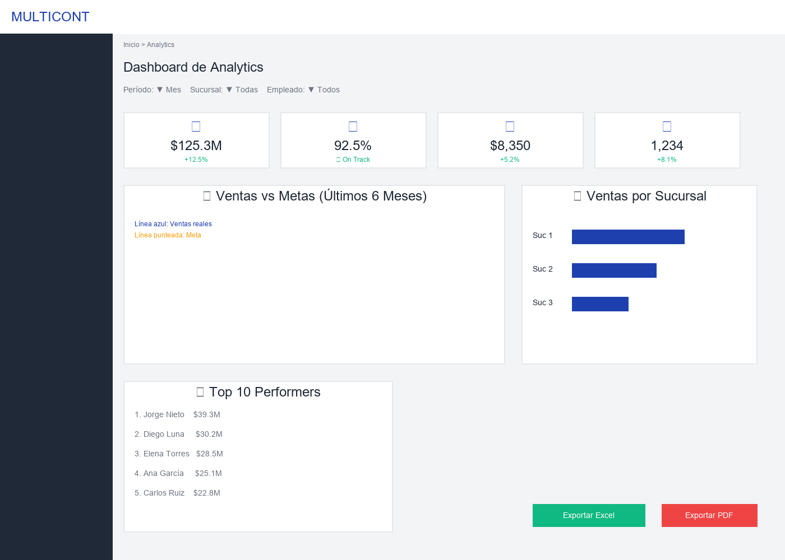
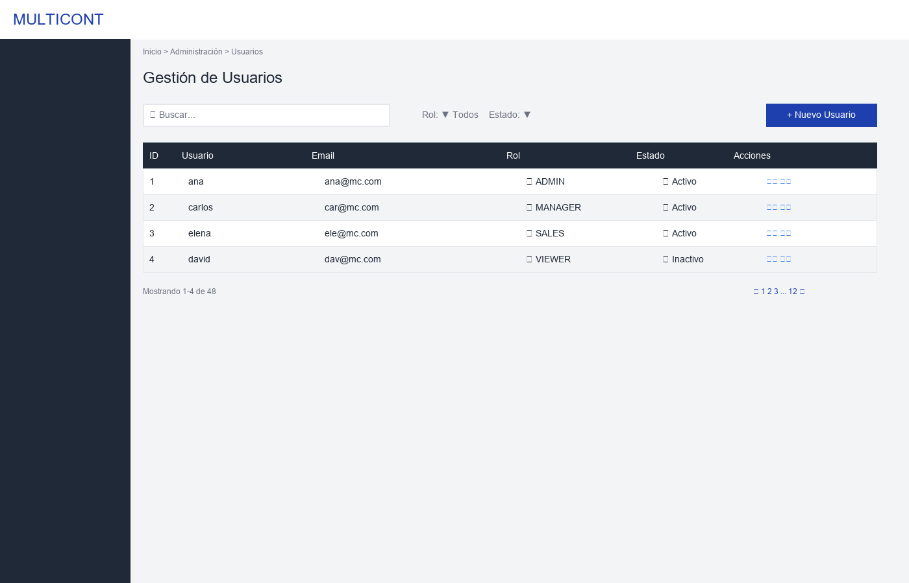

# 📦 Entrega Corte 3 — Diseño Visual, Wireframes y Árbol de Navegación

Fecha: 28 de Octubre de 2025  
Proyecto: Sistema de Gestión Empresarial Multicont  
Versión: 1.0.0

---

Este documento consolida los entregables del tercer corte: wireframes de la aplicación (incluyendo paleta de colores y disposición de controles), árbol de navegación completo, público objetivo, entidad a la que se dirige, estimación de usuarios y características de accesibilidad y de los usuarios. Las imágenes de wireframes fueron generadas a partir de las especificaciones del documento `WIREFRAMES_NUEVOS.md` y se incluyen a continuación.

---

## 🎨 Branding y Paleta de Colores (del documento de wireframes)

Nombre: MULTICONT  
Slogan: "Control Total, Gestión Eficiente"  
Concepto: Sistema profesional de gestión empresarial con enfoque en multi-organización

### Paleta de Colores Corporativa

- Azul Corporativo `#1E40AF` (Headers, botones primarios)
- Gris Oscuro `#1F2937` (Texto principal, sidebar)
- Blanco `#FFFFFF` (Fondos, cards)
- Azul Claro `#3B82F6` (Hover, links)
- Verde Éxito `#10B981` (Éxito)
- Amarillo Alerta `#F59E0B` (Advertencias)
- Rojo Peligro `#EF4444` (Errores/Eliminar)
- Gris Neutro `#6B7280` (Texto secundario, disabled)

### Tipografía (recomendada)
- Títulos: Inter Bold 24–32px  
- Botones: Inter SemiBold 14–16px  
- Texto base: Inter Regular 14px  
- Secundario: Inter Regular 12px

---

## 🧭 Disposición de Controles y Patrón de Interfaz

Los wireframes siguen una estructura consistente:

- Header fijo con logo, búsqueda global, usuario, notificaciones y ajustes.
- Sidebar de navegación con secciones: Inicio, Usuarios (ADMIN), Organizaciones, Sucursales, Empleados, Inventario, Ventas, Analytics (ADMIN/MANAGER), Administración (ADMIN).
- Breadcrumb en la parte superior de contenido.
- Área central para cards, tablas, formularios y gráficos.
- Paginación estándar para listas (10–50 items por página).

---

## 🖼️ Wireframes (imágenes PNG)

Las siguientes imágenes se generaron y se encuentran en esta carpeta (`docs/business/wireframes/`).

### WF-001 — Login


### WF-002 — Dashboard Principal


### WF-003 — Lista de Organizaciones


### WF-004 — Formulario de Organización (Modal)


### WF-005 — Lista de Inventario (con alertas)


### WF-006 — Crear Cotización


### WF-007 — Dashboard de Analytics


### WF-008 — Gestión de Usuarios (ADMIN)


---

## 🗺️ Árbol de Navegación (contenido íntegro)

A continuación se incluye el documento completo `ARBOL_NAVEGACION.md` como parte de esta entrega:

> NOTA: Se preserva exactamente el contenido para evaluación. 

# 🗺️ ÁRBOL DE NAVEGACIÓN - Sistema Multicont

**Proyecto**: Sistema de Gestión Empresarial Multicont  
**Fecha**: 28 de Octubre de 2025  
**Versión**: 3.0.0

---

## 📋 Estructura Completa de Navegación

### Leyenda de Accesos por Rol

| Símbolo | Significado | Roles con Acceso |
|---------|-------------|------------------|
| 🔴 | Acceso ADMIN exclusivo | ADMIN |
| 🟡 | Acceso ADMIN + MANAGER | ADMIN, MANAGER |
| 🟢 | Acceso ADMIN + MANAGER + SALES | ADMIN, MANAGER, SALES |
| ⚪ | Acceso Todos (incluye VIEWER) | ADMIN, MANAGER, SALES, VIEWER |

---

## 🌳 Árbol de Navegación Completo

```
MULTICONT - Sistema de Gestión Empresarial
│
├── 🔐 AUTENTICACIÓN (Pública - Sin login)
│   │
│   ├── 📝 Login
│   │   └── POST /api/auth/login
│   │
│   ├── 🔑 Recuperar Contraseña
│   │   └── POST /api/auth/forgot-password
│   │
│   └── ✉️ Verificar Email
│       └── GET /api/auth/verify-email/{token}
│
│
├── 🏠 INICIO (⚪ Todos los usuarios autenticados)
│   │
│   └── 📊 Dashboard Principal
│       ├── KPIs Principales (4 cards)
│       ├── Gráfico de Ventas (6 meses)
│       ├── Top 5 Productos
│       ├── Alertas Recientes
│       └── GET /api/dashboard/?period=month
│
│
├── 👥 USUARIOS (🔴 ADMIN only)
│   │
│   ├── 📋 Lista de Usuarios
│   │   ├── Búsqueda y filtros
│   │   ├── Paginación
│   │   └── GET /api/users/
│   │
│   ├── ➕ Crear Usuario
│   │   ├── Formulario
│   │   └── POST /api/users/
│   │
│   ├── ✏️ Editar Usuario
│   │   ├── Formulario
│   │   └── PUT /api/users/{id}
│   │
│   ├── 🎭 Asignar Roles
│   │   ├── Modal de roles
│   │   └── PUT /api/users/{id}/roles
│   │
│   ├── 🔄 Activar/Desactivar Usuario
│   │   └── PUT /api/users/{id}/activate
│   │
│   ├── 📊 Estadísticas de Usuarios
│   │   └── GET /api/metrics/users
│   │
│   └── 🗑️ Eliminar Usuario
│       └── DELETE /api/users/{id}
│
│
├── 🏢 GESTIÓN ORGANIZACIONAL
│   │
│   ├── 🏢 ORGANIZACIONES (🟡 ADMIN + MANAGER)
│   │   │
│   │   ├── 📋 Lista de Organizaciones
│   │   │   ├── Búsqueda
│   │   │   ├── Filtros (status)
│   │   │   ├── Paginación
│   │   │   └── GET /api/organizations/
│   │   │
│   │   ├── ➕ Crear Organización
│   │   │   ├── Modal/Form
│   │   │   └── POST /api/organizations/
│   │   │
│   │   ├── ✏️ Editar Organización
│   │   │   ├── Modal/Form
│   │   │   └── PUT /api/organizations/{id}
│   │   │
│   │   ├── 👁️ Ver Detalles
│   │   │   ├── Vista detallada
│   │   │   ├── Sucursales asociadas
│   │   │   └── GET /api/organizations/{id}
│   │   │
│   │   └── 🗑️ Eliminar Organización
│   │       └── DELETE /api/organizations/{id}
│   │
│   │
│   ├── 🏬 SUCURSALES (🟡 ADMIN + MANAGER)
│   │   │
│   │   ├── 📋 Lista de Sucursales
│   │   │   ├── Filtrar por organización
│   │   │   ├── Filtrar por ciudad
│   │   │   └── GET /api/branches/
│   │   │
│   │   ├── ➕ Crear Sucursal
│   │   │   ├── Asignar a organización
│   │   │   ├── Seleccionar ciudad
│   │   │   └── POST /api/branches/
│   │   │
│   │   ├── ✏️ Editar Sucursal
│   │   │   └── PUT /api/branches/{id}
│   │   │
│   │   ├── 👤 Asignar Empleados
│   │   │   └── PUT /api/branches/{id}/assign-employees
│   │   │
│   │   └── 🗑️ Eliminar Sucursal
│   │       └── DELETE /api/branches/{id}
│   │
│   │
│   └── 👤 EMPLEADOS (🟢 ADMIN + MANAGER + SALES-read)
│       │
│       ├── 📋 Lista de Empleados
│       │   ├── Filtrar por sucursal
│       │   ├── Búsqueda por nombre
│       │   └── GET /api/employees/
│       │
│       ├── ➕ Crear Empleado (🟡 ADMIN + MANAGER only)
│       │   ├── Datos personales
│       │   ├── Asignar a sucursal
│       │   └── POST /api/employees/
│       │
│       ├── ✏️ Editar Empleado (🟡 ADMIN + MANAGER only)
│       │   └── PUT /api/employees/{id}
│       │
│       ├── 📦 Historial de Asignaciones (⚪ Todos)
│       │   ├── Items asignados actuales
│       │   ├── Items devueltos
│       │   ├── Items perdidos
│       │   └── GET /api/assignments/employee/{id}/history
│       │
│       ├── 🎯 Metas del Empleado (⚪ Todos)
│       │   ├── Metas actuales
│       │   ├── Cumplimiento
│       │   └── GET /api/sales_goals/employee/{id}
│       │
│       └── 🗑️ Eliminar Empleado (🟡 ADMIN + MANAGER only)
│           └── DELETE /api/employees/{id}
│
│
├── 📦 INVENTARIO
│   │
│   ├── 📦 ITEMS DE INVENTARIO
│   │   │
│   │   ├── 📋 Lista de Items (⚪ Todos - Solo lectura para SALES/VIEWER)
│   │   │   ├── Búsqueda
│   │   │   ├── Filtros (categoría, marca, stock)
│   │   │   ├── Alertas de stock bajo (< 10)
│   │   │   └── GET /api/inventory_items/
│   │   │
│   │   ├── ➕ Crear Item (🟡 ADMIN + MANAGER only)
│   │   │   ├── Nombre, descripción
│   │   │   ├── Categoría, marca
│   │   │   ├── Precio, cantidad
│   │   │   └── POST /api/inventory_items/
│   │   │
│   │   ├── ✏️ Editar Item (🟡 ADMIN + MANAGER only)
│   │   │   └── PUT /api/inventory_items/{id}
│   │   │
│   │   ├── 📈 Agregar Stock (🟡 ADMIN + MANAGER only)
│   │   │   ├── Modal de cantidad
│   │   │   └── PUT /api/inventory_items/{id}/add-stock
│   │   │
│   │   ├── 📉 Reducir Stock (🟡 ADMIN + MANAGER only)
│   │   │   └── PUT /api/inventory_items/{id}/remove-stock
│   │   │
│   │   ├── ⚠️ Alertas de Stock Bajo (⚪ Todos)
│   │   │   └── GET /api/inventory_items/?status=low_stock
│   │   │
│   │   └── 🗑️ Eliminar Item (🟡 ADMIN + MANAGER only)
│   │       └── DELETE /api/inventory_items/{id}
│   │
│   │
│   ├── 🏷️ CATEGORÍAS (🟡 ADMIN + MANAGER only)
│   │   │
│   │   ├── 📋 Lista de Categorías
│   │   │   └── GET /api/categories/
│   │   │
│   │   ├── ➕ Crear Categoría
│   │   │   └── POST /api/categories/
│   │   │
│   │   ├── ✏️ Editar Categoría
│   │   │   └── PUT /api/categories/{id}
│   │   │
│   │   └── 🗑️ Eliminar Categoría
│   │       └── DELETE /api/categories/{id}
│   │
│   │
│   ├── 🔖 MARCAS (🟡 ADMIN + MANAGER only)
│   │   │
│   │   ├── 📋 Lista de Marcas
│   │   │   └── GET /api/brands/
│   │   │
│   │   ├── ➕ Crear Marca
│   │   │   └── POST /api/brands/
│   │   │
│   │   ├── ✏️ Editar Marca
│   │   │   └── PUT /api/brands/{id}
│   │   │
│   │   ├── 🔍 Buscar por Nombre
│   │   │   └── GET /api/brands/search?name={query}
│   │   │
│   │   └── 🗑️ Eliminar Marca
│   │       └── DELETE /api/brands/{id}
│   │
│   │
│   └── 🔖 ASIGNACIONES (🟡 ADMIN + MANAGER only)
│       │
│       ├── 📋 Lista de Asignaciones
│       │   ├── Filtros (status, empleado)
│       │   └── GET /api/assignments/
│       │
│       ├── ➕ Asignar Item a Empleado
│       │   ├── Seleccionar empleado
│       │   ├── Seleccionar item
│       │   ├── Cantidad
│       │   └── POST /api/assignments/
│       │
│       ├── ✅ Marcar como Devuelto
│       │   ├── Condición (bueno/dañado)
│       │   ├── Notas
│       │   └── PUT /api/assignments/{id}/return
│       │
│       ├── ⚠️ Marcar como Perdido
│       │   ├── Notas/justificación
│       │   └── PUT /api/assignments/{id}/lost
│       │
│       └── 📊 Historial por Empleado
│           └── GET /api/assignments/employee/{id}/history
│
│
├── 💰 VENTAS
│   │
│   ├── 📝 COTIZACIONES (🟢 ADMIN + MANAGER + SALES)
│   │   │
│   │   ├── 📋 Lista de Cotizaciones (⚪ Todos)
│   │   │   ├── Mis cotizaciones (SALES)
│   │   │   ├── Todas las cotizaciones (ADMIN/MANAGER)
│   │   │   ├── Filtros (estado, fecha, cliente)
│   │   │   └── GET /api/quotes/
│   │   │
│   │   ├── ➕ Crear Cotización (🟢 Todos)
│   │   │   ├── Información general
│   │   │   ├── Agregar líneas de productos
│   │   │   ├── Cálculo automático de totales
│   │   │   └── POST /api/quotes/
│   │   │
│   │   ├── ✏️ Editar Cotización (🟢 Propio/ADMIN/MANAGER)
│   │   │   └── PUT /api/quotes/{id}
│   │   │
│   │   ├── ➕ Agregar Líneas (🟢 Todos)
│   │   │   ├── Seleccionar producto
│   │   │   ├── Cantidad
│   │   │   └── POST /api/quotation_lines/
│   │   │
│   │   ├── ✅ Aprobar Cotización (🟡 ADMIN + MANAGER only)
│   │   │   └── PUT /api/quotes/{id}/approve
│   │   │
│   │   ├── 🔄 Convertir a Orden de Venta (🟡 ADMIN + MANAGER only)
│   │   │   └── POST /api/sales_orders/ (from quote)
│   │   │
│   │   ├── 📄 Ver Detalles (⚪ Todos)
│   │   │   ├── Información general
│   │   │   ├── Líneas de productos
│   │   │   ├── Totales
│   │   │   └── GET /api/quotes/{id}
│   │   │
│   │   └── 🗑️ Eliminar Cotización (🟡 ADMIN + MANAGER only)
│   │       └── DELETE /api/quotes/{id}
│   │
│   │
│   ├── 📦 ÓRDENES DE VENTA (🟡 ADMIN + MANAGER only)
│   │   │
│   │   ├── 📋 Lista de Órdenes
│   │   │   ├── Filtros (estado, fecha)
│   │   │   └── GET /api/sales_orders/
│   │   │
│   │   ├── ➕ Crear Orden (desde cotización o manual)
│   │   │   └── POST /api/sales_orders/
│   │   │
│   │   ├── ✏️ Editar Orden
│   │   │   └── PUT /api/sales_orders/{id}
│   │   │
│   │   ├── 🔄 Convertir a Factura
│   │   │   └── POST /api/invoices/ (from order)
│   │   │
│   │   ├── ❌ Cancelar Orden
│   │   │   └── PUT /api/sales_orders/{id}/cancel
│   │   │
│   │   ├── 📄 Ver Detalles
│   │   │   └── GET /api/sales_orders/{id}
│   │   │
│   │   └── 🗑️ Eliminar Orden
│   │       └── DELETE /api/sales_orders/{id}
│   │
│   │
│   ├── 🧾 FACTURAS (🟡 ADMIN + MANAGER only)
│   │   │
│   │   ├── 📋 Lista de Facturas
│   │   │   ├── Filtros (estado, fecha, empleado)
│   │   │   └── GET /api/invoices/
│   │   │
│   │   ├── ➕ Crear Factura (desde orden o manual)
│   │   │   └── POST /api/invoices/
│   │   │
│   │   ├── 📄 Ver Detalles de Factura
│   │   │   ├── Información completa
│   │   │   ├── Items facturados
│   │   │   └── GET /api/invoices/{id}
│   │   │
│   │   ├── ❌ Anular Factura
│   │   │   └── PUT /api/invoices/{id}/void
│   │   │
│   │   ├── 📥 Descargar PDF
│   │   │   └── GET /api/invoices/{id}/pdf
│   │   │
│   │   └── 🗑️ Eliminar Factura
│   │       └── DELETE /api/invoices/{id}
│   │
│   │
│   └── 🎯 METAS DE VENTAS (🟡 ADMIN + MANAGER only)
│       │
│       ├── 📋 Lista de Metas
│       │   ├── Filtros (tipo, empleado, sucursal)
│       │   └── GET /api/sales_goals/
│       │
│       ├── ➕ Crear Meta Nueva
│       │   ├── Tipo (mensual/trimestral/anual)
│       │   ├── Asignar a empleado o sucursal
│       │   ├── Monto objetivo
│       │   ├── Período
│       │   └── POST /api/sales_goals/
│       │
│       ├── ✏️ Editar Meta
│       │   └── PUT /api/sales_goals/{id}
│       │
│       ├── 📊 Seguimiento de Cumplimiento
│       │   ├── Metas actuales
│       │   ├── Porcentaje de cumplimiento
│       │   └── GET /api/sales_goals/current
│       │
│       ├── 📈 Metas vs Actual
│       │   ├── Comparación en tiempo real
│       │   ├── Gráficos de tendencia
│       │   └── GET /api/analytics/goals/vs_actual
│       │
│       └── 🗑️ Eliminar Meta
│           └── DELETE /api/sales_goals/{id}
│
│
├── 📊 ANALYTICS Y REPORTES (🟡 ADMIN + MANAGER only)
│   │
│   ├── 📊 DASHBOARD DE VENTAS
│   │   │
│   │   ├── 📈 Gráfico de Ventas Mensuales
│   │   │   └── GET /api/analytics/sales/summary
│   │   │
│   │   ├── 🎯 Comparación vs Metas
│   │   │   └── GET /api/analytics/goals/vs_actual
│   │   │
│   │   ├── 📊 Tendencias de Ventas
│   │   │   └── GET /api/dashboard/?period=year
│   │   │
│   │   └── 🔮 Proyecciones
│   │       └── (Calculado en frontend)
│   │
│   │
│   ├── 💰 FACTURACIÓN
│   │   │
│   │   ├── 👤 Por Empleado
│   │   │   ├── Total facturado
│   │   │   ├── Número de facturas
│   │   │   └── GET /api/analytics/invoicing/by_employee
│   │   │
│   │   ├── 🏬 Por Sucursal
│   │   │   ├── Consolidado por sucursal
│   │   │   ├── Empleados por sucursal
│   │   │   └── GET /api/analytics/invoicing/by_branch
│   │   │
│   │   ├── 🔖 Por Marca
│   │   │   ├── Total facturado
│   │   │   ├── Cantidad vendida
│   │   │   └── GET /api/analytics/invoicing/by_brand
│   │   │
│   │   └── 📅 Por Período
│   │       └── Filtros de fecha en todos los endpoints
│   │
│   │
│   ├── 📝 COTIZACIONES
│   │   │
│   │   ├── 🔖 Por Marca
│   │   │   ├── Número de cotizaciones
│   │   │   ├── Cantidad solicitada
│   │   │   └── GET /api/analytics/quotes/by_brand
│   │   │
│   │   ├── 📊 Tasa de Conversión
│   │   │   └── Cotizaciones → Órdenes → Facturas (%)
│   │   │
│   │   └── 📈 Análisis de Tendencias
│   │       └── (Calculado en frontend)
│   │
│   │
│   ├── 🏆 INDICADORES DE RENDIMIENTO
│   │   │
│   │   ├── 👑 Top Performers
│   │   │   ├── Ranking de vendedores
│   │   │   ├── Total de ventas
│   │   │   └── GET /api/analytics/top_performers
│   │   │
│   │   ├── 🎯 Cumplimiento de Metas
│   │   │   ├── Porcentaje global
│   │   │   ├── Por empleado
│   │   │   └── GET /api/analytics/goals/vs_actual
│   │   │
│   │   ├── 🏬 Ranking de Sucursales
│   │   │   └── GET /api/analytics/invoicing/by_branch
│   │   │
│   │   └── 📦 Productos Más Vendidos
│   │       └── (Calculado desde facturación)
│   │
│   │
│   └── 📥 EXPORTAR REPORTES
│       │
│       ├── 📄 Excel (.xlsx)
│       │   └── (Generado en frontend con SheetJS)
│       │
│       ├── 📕 PDF
│       │   └── (Generado con jsPDF)
│       │
│       └── 📊 CSV
│           └── (Export directo de tablas)
│
│
├── 🎯 METAS Y OBJETIVOS (🟡 ADMIN + MANAGER only)
│   │
│   ├── 📊 Dashboard de Metas
│   │   ├── Metas actuales activas
│   │   ├── Cumplimiento global (%)
│   │   ├── Alertas de riesgo
│   │   └── GET /api/sales_goals/current
│   │
│   ├── ➕ Crear Meta Nueva
│   │   └── (Ver sección Ventas > Metas)
│   │
│   ├── 🎯 Asignar Meta
│   │   ├── A empleado individual
│   │   └── A sucursal completa
│   │
│   ├── 📈 Seguimiento en Tiempo Real
│   │   ├── Progreso actual
│   │   ├── Días restantes
│   │   └── Proyección de cumplimiento
│   │
│   └── 📊 Metas vs Actual
│       └── GET /api/analytics/goals/vs_actual
│
│
├── 🔧 ADMINISTRACIÓN (🔴 ADMIN only)
│   │
│   ├── 🎭 ROLES Y PERMISOS
│   │   │
│   │   ├── 📋 Lista de Roles
│   │   │   └── GET /api/roles/
│   │   │
│   │   ├── ➕ Crear Rol
│   │   │   └── POST /api/roles/
│   │   │
│   │   ├── 🔑 Asignar Permisos
│   │   │   ├── Matriz de permisos
│   │   │   └── PUT /api/roles/{id}/permissions
│   │   │
│   │   ├── 👥 Ver Usuarios por Rol
│   │   │   └── GET /api/user_roles/?role_id={id}
│   │   │
│   │   └── 🗑️ Eliminar Rol
│   │       └── DELETE /api/roles/{id}
│   │
│   │
│   ├── 🔑 PERMISOS
│   │   │
│   │   ├── 📋 Lista de Permisos
│   │   │   └── GET /api/permissions/
│   │   │
│   │   ├── ➕ Crear Permiso
│   │   │   └── POST /api/permissions/
│   │   │
│   │   ├── 📊 Matriz de Permisos
│   │   │   └── Vista de roles × permisos
│   │   │
│   │   └── 🗑️ Eliminar Permiso
│   │       └── DELETE /api/permissions/{id}
│   │
│   │
│   └── ⚙️ CONFIGURACIÓN DEL SISTEMA
│       │
│       ├── 🔧 Variables de Entorno
│       │   └── (Solo lectura en UI)
│       │
│       ├── 📄 Logs del Sistema
│       │   └── Ver logs en tiempo real
│       │
│       └── 💾 Respaldo de Base de Datos
│           ├── Crear backup
│           └── Restaurar backup
│
│
└── 👤 PERFIL DE USUARIO (⚪ Todos)
    │
    ├── 👁️ Ver Perfil
    │   ├── Información personal
    │   ├── Rol actual
    │   └── GET /api/users/{id}
    │
    ├── ✏️ Editar Información Personal
    │   ├── Nombre, email
    │   └── PUT /api/users/{id}
    │
    ├── 🔒 Cambiar Contraseña
    │   ├── Contraseña actual
    │   ├── Contraseña nueva
    │   └── PUT /api/users/{id}/change-password
    │
    ├── 📝 Mis Cotizaciones (🟢 SALES only)
    │   └── GET /api/quotes/?employee_id={current_user}
    │
    ├── 🎯 Mis Metas (🟢 SALES only)
    │   ├── Metas asignadas
    │   ├── Progreso actual
    │   └── GET /api/sales_goals/employee/{current_user}
    │
    └── 🚪 Cerrar Sesión
        └── POST /api/auth/logout
```

---

## 👥 Público objetivo, entidad y cantidad de usuarios

(Extraído de `WIREFRAMES_NUEVOS.md`)

- Entidad objetivo: Empresas medianas y grandes con múltiples sucursales (comercio, distribución, servicios industriales).  
- Tamaño de usuarios por empresa: 10–20 (pequeña), 50–100 (mediana), 200–500 (grande).  
- Total estimado multi-tenant: hasta 10,000 usuarios concurrentes.  
- Distribución de roles (por 100 usuarios): ADMIN 2–3%, MANAGER 10–15%, SALES 60–70%, VIEWER 15–20%.

---

## 👤 Características de los usuarios

- Conocimiento tecnológico por rol: ADMIN (alto), MANAGER (medio-alto), SALES (básico-medio), VIEWER (medio).  
- Dispositivos de acceso: Desktop 70%, Laptop 20%, Tablet 8%, Móvil 2%. Navegadores: Chrome/Edge/Firefox/Safari modernos.  
- Modo responsivo: mobile-first con breakpoints (sm, md, lg, xl, 2xl).  
- Conectividad: optimizado para 3–10 Mbps con paginación, compresión, cache y lazy loading.

---

## ♿ Accesibilidad considerada

- Objetivo WCAG 2.1 AA.  
- Contraste de colores verificado (ej.: #1F2937 sobre #FFFFFF = 16.1:1).  
- Navegación por teclado (Tab, Shift+Tab, Enter, Escape, flechas) y estados accesibles (role, aria-*).  
- Soporte lectores de pantalla (NVDA, JAWS, VoiceOver, TalkBack).  
- Tamaños mínimos: fuente base 14px, botones 44×44px, zoom 200% sin pérdida.  
- Alternativas de color para daltónicos (iconografía, patrones, texto descriptivo).

---

## ✅ Cobertura de requerimientos (resumen)

- Wireframes con paleta de colores y disposición de controles: Incluidos (8 pantallas con PNG + lineamientos).  
- Árbol de navegación funcional y administrativo: Incluido íntegro.  
- Público objetivo, entidad y cantidad de usuarios: Incluido.  
- Características de usuarios y accesibilidad: Incluidas.
